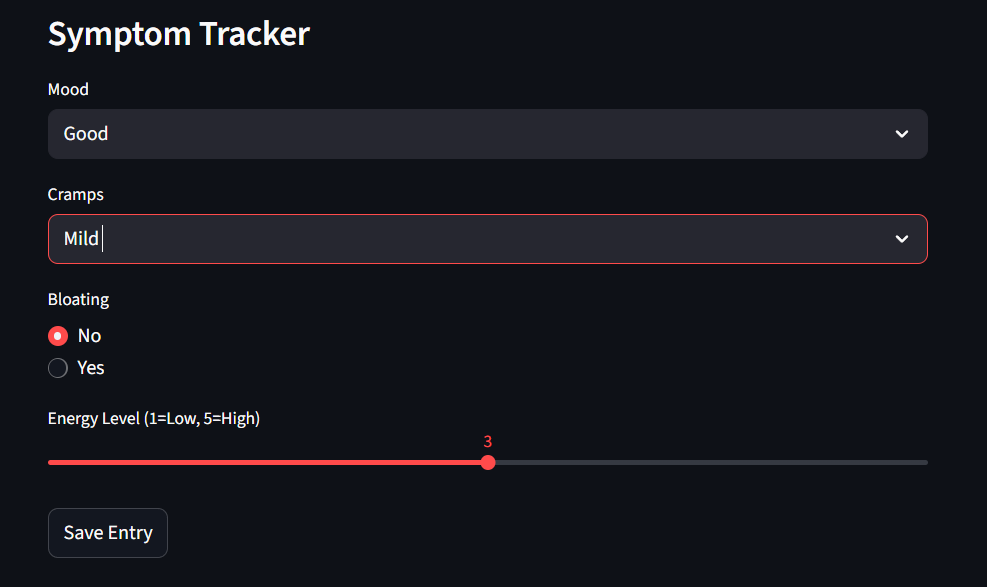
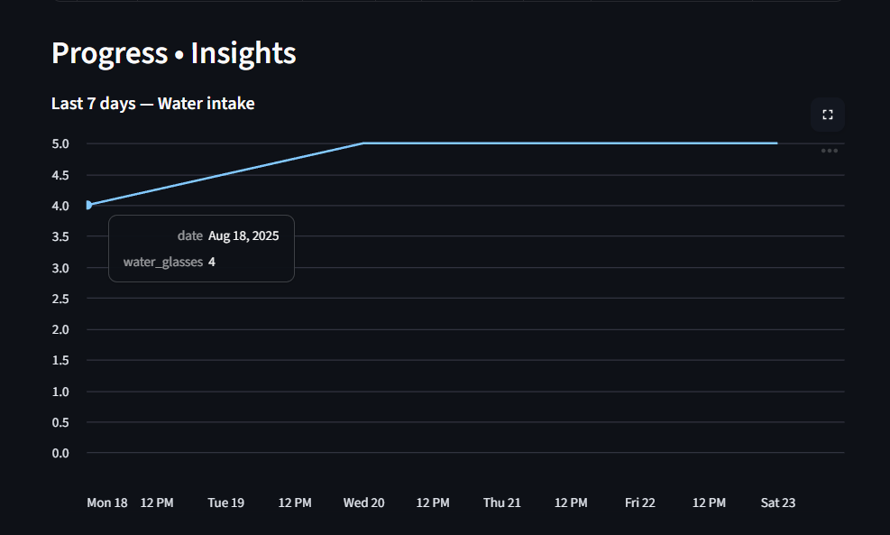
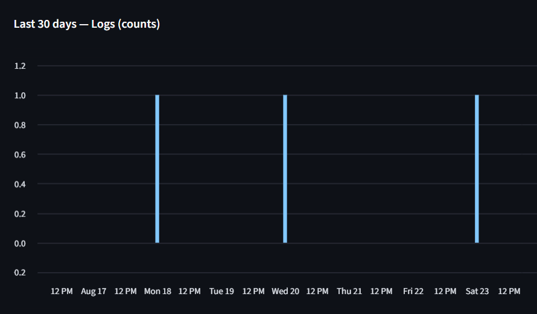
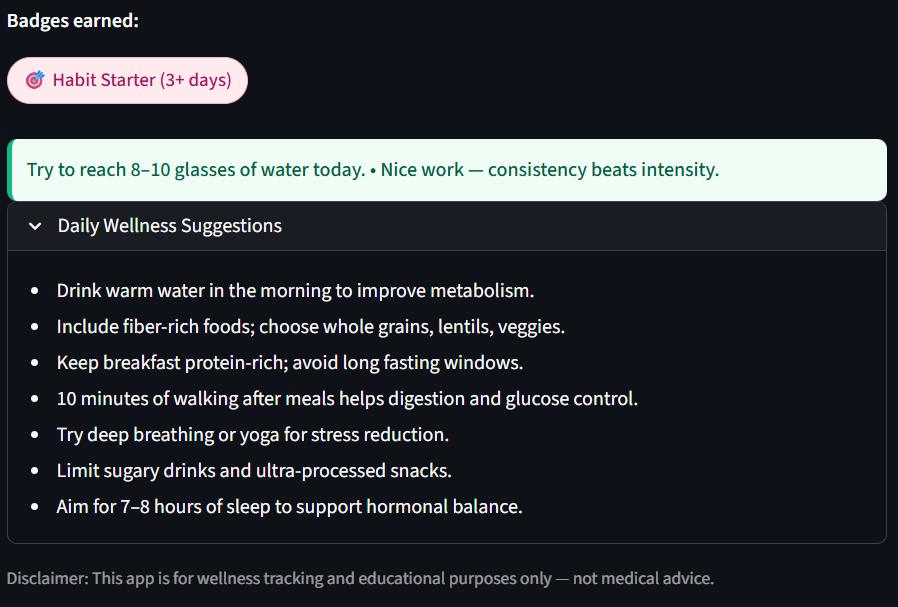
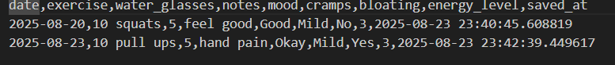

# PCOD_Tracker

A simple Streamlit web app to track PCOD-friendly habits: water intake, exercise, and daily wellness.

## Features

- Log daily **exercise**, **water intake**, and **symptoms** (mood, cramps, bloating, energy level)
- Track **streaks** and **badges earned** for motivation
- Visualize **weekly water intake** and **day-wise logs**
- Quick and friendly interface designed for beginners

## 📸 Screenshots










## How to Run

1. Install dependencies:

```bash
pip install -r requirements.txt

2. Run the app:

streamlit run app.py

3. Open the URL shown in the terminal (usually http://localhost:8501) in your browser.

Tech Stack

- Language: Python
- Framework: Streamlit
- Data: CSV (pandas)
- Visualization: Streamlit line charts and bar charts
- Cloud (optional): Can deploy on Streamlit Cloud


